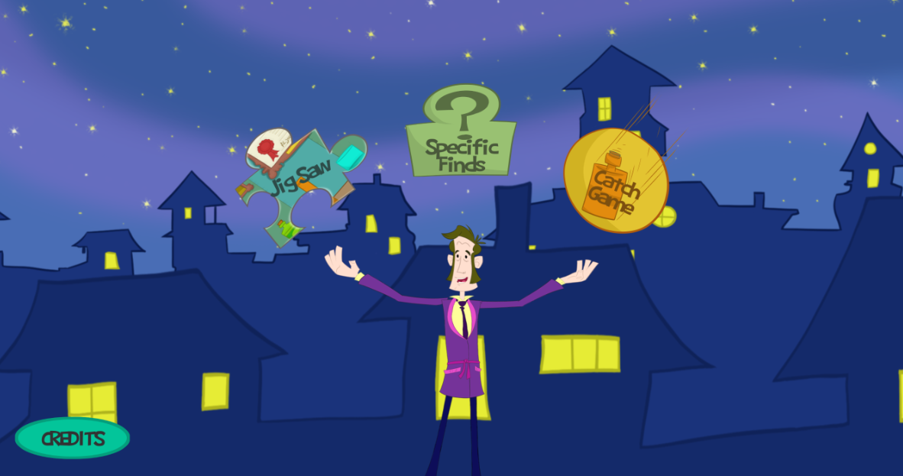
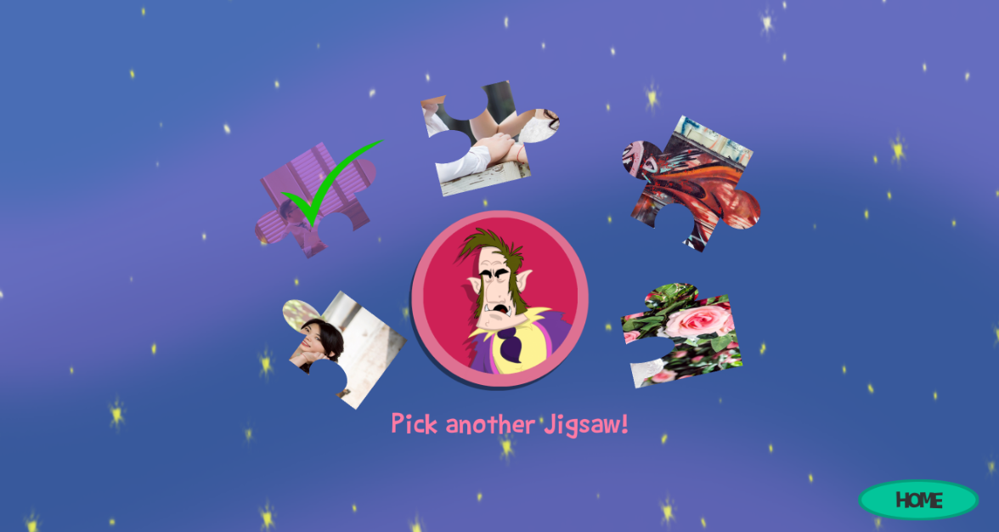
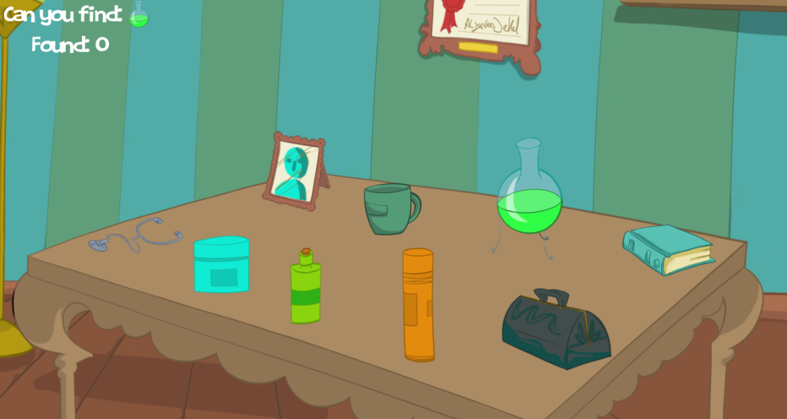
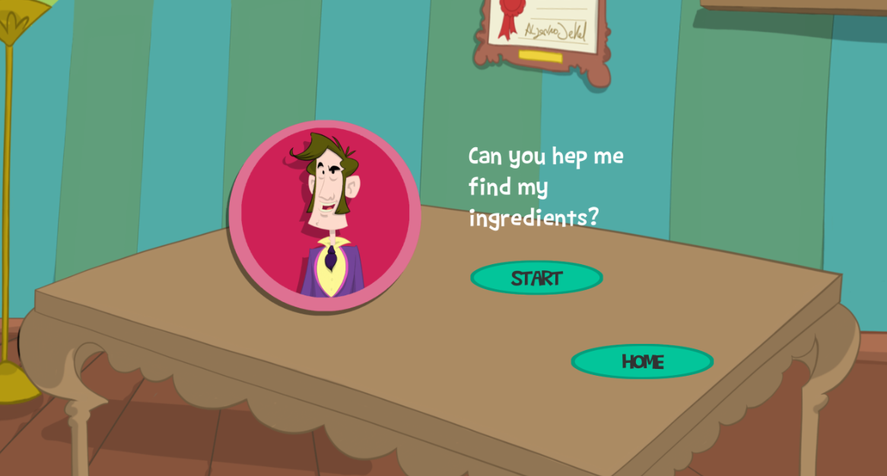
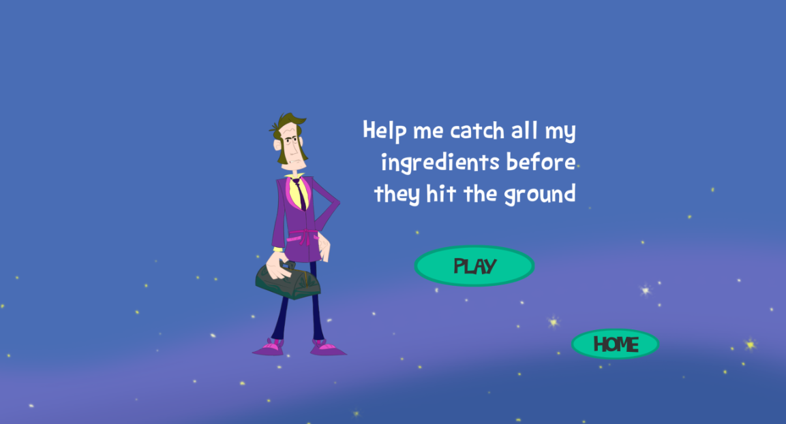
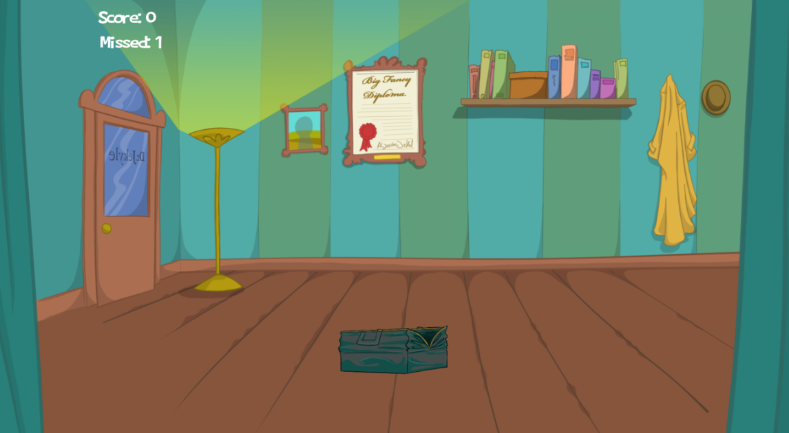

# Fungus_Jig

Fungus Jig is a mobile game created by using Unity.
Studied with the Lecture on Udemy from Fungus Team. Created a 2D Game which can run on Android Platfom by using Unity with Fungus plugin. Also, redo the jigsaw part by using own images with Photoshop cut.

Latest version
---
- Version 0.5  (11/15/2017)

License
---

https://www.udemy.com/create-puzzle-games-with-unity-3d-fungus-zero-coding/learn/v4/overview

Please do not use it for any commercial purpose.

## Demos

